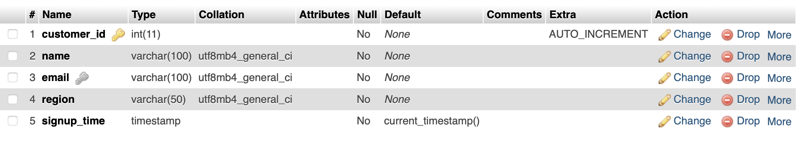

# 🛒 E-commerce Sales Database 📊

## 📌 Project Overview
This repository contains an **E-commerce Sales Database** designed for **data analysis, business intelligence, and reporting**. The database includes structured sales data with relationships between **customers, products, transactions, and regions**.

The dataset is designed to be used with **SQL queries, Tableau, Power BI, and Python-based data analysis tools**.

---

## 📂 Database Schema

The database consists of the following tables:

### **🧑 Customers Table**


### **📦 Products Table**


### **📦 Products Table Data**


### **🌍 Regions Table**


### **💰 Sales Table**


---

## 📊 Key Data Insights

### **1️⃣ Customer Spendings**
This query shows the **top 10 customers** ranked by their total spending.
```sql
SELECT c.name, SUM(s.total_amount) AS total_spent 
FROM sales s 
JOIN customers c ON s.customer_id = c.customer_id 
GROUP BY c.name 
ORDER BY total_spent DESC 
LIMIT 10;
```
**📊 Output:**


---

### **2️⃣ Monthly Sales Performance**
The following query retrieves **monthly sales trends**.
```sql
SELECT DATE_FORMAT(sale_date, '%M %Y') AS month, SUM(total_amount) AS monthly_sales 
FROM sales 
GROUP BY month 
ORDER BY month;
```
**📊 Output:**


---

### **3️⃣ Best-Selling Products**
This query helps identify the **top 5 most sold products**.
```sql
SELECT p.name, SUM(s.quantity) AS total_sold 
FROM sales s 
JOIN products p ON s.product_id = p.product_id 
GROUP BY p.name 
ORDER BY total_sold DESC 
LIMIT 5;
```
**📊 Output:**


---

### **4️⃣ Total Sales by Region**
This query calculates the **total revenue generated by each region**.
```sql
SELECT region, SUM(total_amount) AS total_sales 
FROM sales 
GROUP BY region 
ORDER BY total_sales DESC;
```
**📊 Output:**


---

## 🎯 Views and Stored Procedures

### **5️⃣ Sales by Region View**
This view stores precomputed total sales for each region.
```sql
CREATE VIEW salesbyregion AS
SELECT region, SUM(total_amount) AS total_sales 
FROM sales 
GROUP BY region;
```
**📊 Output:**


---

## ⚙️ Triggers

### **6️⃣ Stock Update Trigger**
This trigger automatically updates the stock quantity when a sale is recorded.
```sql
CREATE TRIGGER UpdateStockAfterSale
AFTER INSERT ON sales
FOR EACH ROW
BEGIN
    UPDATE products 
    SET stock_quantity = stock_quantity - NEW.quantity
    WHERE product_id = NEW.product_id;
END;
```
**📊 Output:**


---

## 🚀 How to Use

### 💾 **Import Database**
1. Open MySQL or MariaDB.
2. Run:
   ```sh
   mysql -u root -p < e_comm_db.sql
   ```
3. Verify the database using:
   ```sql
   SHOW TABLES;
   ```

### 🔎 **Query & Analyze**
- Use MySQL Workbench, DBeaver, or any SQL editor to run the queries.
- Connect the database to **Tableau or Power BI** for visualization.

---

## 📌 Future Enhancements
- 📢 **More Sales Trends & Insights**
- 📊 **Automated Reports Using MySQL Views**
- ⚡ **Implementing Indexes for Faster Query Performance**
- 🔄 **Integration with Python for Data Science & Machine Learning**

---

## 🛠️ Contributing
Feel free to **fork, modify, and contribute** to this project. Pull requests are welcome!

---

## 📝 License
This project is licensed under the **MIT License**. You are free to use and modify it for personal or commercial use.

---

🔗 **Created By:** *[Your Name or GitHub Profile](https://github.com/iRahulGaur)*  
⭐ Don't forget to **star this repo** if you find it useful!
